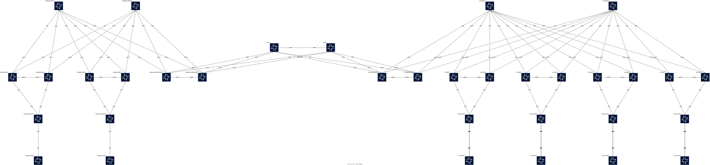

# Arista EVPN-VXLAN ContainerLab — DC + Core + Campus

An extended Arista BGP EVPN-VXLAN multi-fabric lab using ContainerLab and cEOS. The topology interconnects a **Data Center fabric** and a **Campus fabric** through a dedicated **Core L3 transit zone**, with a VRF (`gold`) stretched end-to-end across both fabrics.

## 🎯 Overview

| Zone   | Devices                                                                             |
| ------ | ----------------------------------------------------------------------------------- |
| DC     | 2 spines, 8 leafs (4 MLAG VTEPs), 2 border leafs (MLAG), 4 access switches, 4 hosts |
| Core   | 2 core routers (iBGP AS 65500, OSPF underlay with BLs, eBGP to DC & Campus BLs)     |
| Campus | 2 spines, 4 leafs (2 MLAG VTEPs), 2 border leafs (MLAG), 2 access switches, 2 hosts |

Key design choices:

- **eBGP** in both fabrics (underlay + EVPN overlay) between spines and leafs / border leafs.
- **OSPF area 0 + eBGP multi-hop** between each Border Leaf pair and both Core routers (over dot1q subinterfaces: `.100` = default VRF underlay, `.200` = VRF `gold`).
- **MLAG** everywhere there is dual-homing at the fabric layers (leaf pairs, border-leaf pairs, access → leafs, and DC host → access).
- **Host attachment pattern**:
    - **DC hosts** (servers) are **dual-homed via LACP** to an access switch — typical DC
      server redundancy.
    - **Campus hosts** (user endpoints: PC, phone, printer) are **single-attached** to a
      Campus access switch via one plain Ethernet link. Redundancy lives at the access-switch
      layer (the access switch itself is dual-homed via LACP to its leaf MLAG pair), not at
      the host.
- **VRF `gold`** is stretched end-to-end: DC leafs (VLAN 34 / 78) ↔ DC-BL ↔ Core ↔ Campus-BL ↔ Campus leafs (VLAN 60 / 70), all sharing L3 VNI `100001`.
- **VLAN 50** remains defined as a campus-local L2 VXLAN stretched between the two Campus VTEPs (infrastructure-only, not wired to any host in the current topology).
- **Convention**: L2 VNI = `110000 + vlan_id`, L3 VNI = `100001` for VRF `gold`, RT `1:100001` in both fabrics.

## 📐 Topology



## 🚀 Quick Start

### Prerequisites

- ContainerLab
- Docker
- Arista cEOS image: `ceos:4.36.0`

### Deploy the Lab

```bash
git clone https://gitea.arnodo.fr/Damien/arista-evpn-vxlan-clab.git
cd arista-evpn-vxlan-clab

sudo containerlab deploy -t evpn-lab.clab.yml
sudo containerlab inspect -t evpn-lab.clab.yml
```

### Access Devices

```bash
# SSH (password: admin) — works for every cEOS node
ssh admin@clab-arista-evpn-fabric-leaf1
ssh admin@clab-arista-evpn-fabric-core1
ssh admin@clab-arista-evpn-fabric-campus-leaf1

# Or via docker exec
docker exec -it clab-arista-evpn-fabric-dc-border-leaf1 Cli
```

## 📋 Architecture

### Node Inventory

| Zone   | Role               | Nodes                                        | AS    |
| ------ | ------------------ | -------------------------------------------- | ----- |
| DC     | Spine              | `dc-spine1`, `dc-spine2`                     | 65000 |
| DC     | Leaf VTEP1 (MLAG)  | `dc-leaf1`, `dc-leaf2`                       | 65001 |
| DC     | Leaf VTEP2 (MLAG)  | `dc-leaf3`, `dc-leaf4`                       | 65002 |
| DC     | Leaf VTEP3 (MLAG)  | `dc-leaf5`, `dc-leaf6`                       | 65003 |
| DC     | Leaf VTEP4 (MLAG)  | `dc-leaf7`, `dc-leaf8`                       | 65004 |
| DC     | Border Leaf (MLAG) | `dc-border-leaf1`, `dc-border-leaf2`         | 65005 |
| DC     | Access (L2-only)   | `dc-access1`-`dc-access4`                    | —     |
| DC     | Host               | `dc-server1`-`dc-server4`                    | —     |
| Core   | Core router        | `core1`, `core2`                             | 65500 |
| Campus | Spine              | `campus-spine1`, `campus-spine2`             | 66000 |
| Campus | Leaf VTEP1 (MLAG)  | `campus-leaf1`, `campus-leaf2`               | 66001 |
| Campus | Leaf VTEP2 (MLAG)  | `campus-leaf3`, `campus-leaf4`               | 66002 |
| Campus | Border Leaf (MLAG) | `campus-border-leaf1`, `campus-border-leaf2` | 66005 |
| Campus | Access (L2-only)   | `campus-access1`, `campus-access2`           | —     |
| Campus | Host               | `campus-host1`, `campus-host2`               | —     |

### AS Numbering

| AS    | Role                              |
| ----- | --------------------------------- |
| 65000 | DC Spine                          |
| 65001 | DC VTEP1 (dc-leaf1/2)             |
| 65002 | DC VTEP2 (dc-leaf3/4)             |
| 65003 | DC VTEP3 (dc-leaf5/6)             |
| 65004 | DC VTEP4 (dc-leaf7/8)             |
| 65005 | DC Border Leaf pair               |
| 65500 | Core (iBGP between core1 & core2) |
| 66000 | Campus Spine                      |
| 66001 | Campus VTEP1 (campus-leaf1/2)     |
| 66002 | Campus VTEP2 (campus-leaf3/4)     |
| 66005 | Campus Border Leaf pair           |

### Access Switches

| Access Switch  | Uplink Pair            | VLANs | Host         | Host attachment           |
| -------------- | ---------------------- | ----- | ------------ | ------------------------- |
| dc-access1     | dc-leaf1/2 (VTEP1)     | 40    | dc-server1   | LACP Po1 (dual-homed)     |
| dc-access2     | dc-leaf3/4 (VTEP2)     | 34    | dc-server2   | LACP Po1 (dual-homed)     |
| dc-access3     | dc-leaf5/6 (VTEP3)     | 40    | dc-server3   | LACP Po1 (dual-homed)     |
| dc-access4     | dc-leaf7/8 (VTEP4)     | 78    | dc-server4   | LACP Po1 (dual-homed)     |
| campus-access1 | campus-leaf1/2 (VTEP1) | 60    | campus-host1 | access port (single link) |
| campus-access2 | campus-leaf3/4 (VTEP2) | 70    | campus-host2 | access port (single link) |

All access switches are L2-only, LACP-bonded to their leaf MLAG pair via `Port-Channel10`. MSTP + edge-port BPDU guard.

Host-facing ports:

- **DC access switches** run a `Port-Channel1` trunk (VLANs allowed per host) for a host
  dual-homed in LACP (two physical links, one bond on the Linux side).
- **Campus access switches** use a plain `Ethernet3` in `switchport mode access` with
  BPDU guard + portfast — the host connects with a single Ethernet link and no bonding.

## 🧭 IP Addressing Plan

### Management (`172.16.0.0/24`)

| Node            | IP             | Node                | IP               |
| --------------- | -------------- | ------------------- | ---------------- |
| dc-spine1       | 172.16.0.1     | campus-spine1       | 172.16.0.20      |
| dc-spine2       | 172.16.0.2     | campus-spine2       | 172.16.0.21      |
| dc-border-leaf1 | 172.16.0.3     | campus-border-leaf1 | 172.16.0.22      |
| dc-border-leaf2 | 172.16.0.4     | campus-border-leaf2 | 172.16.0.23      |
| core1           | 172.16.0.10    | campus-leaf1-4      | 172.16.0.51-54   |
| core2           | 172.16.0.11    | campus-access1      | 172.16.0.61      |
| dc-leaf1        | 172.16.0.25    | campus-access2      | 172.16.0.62      |
| dc-leaf2        | 172.16.0.50    | dc-server1-4        | 172.16.0.101-104 |
| dc-leaf3-8      | 172.16.0.27-32 | campus-host1        | 172.16.0.105     |
| dc-access1-4    | 172.16.0.41-44 | campus-host2        | 172.16.0.106     |
|                 |                | gnmic               | 172.16.0.70      |
|                 |                | prometheus          | 172.16.0.71      |

Gateway: `172.16.0.254`.

### Router-ID Loopback0 (`Lo0`)

| Zone   | Range           | Nodes                                                                                      |
| ------ | --------------- | ------------------------------------------------------------------------------------------ |
| DC     | `10.0.250.0/24` | dc-spine1 .1, dc-spine2 .2, dc-leaf1-8 .11-.18, BL-dc1 .21, BL-dc2 .22                     |
| Core   | `10.0.200.0/24` | core1 `10.0.200.1`, core2 `10.0.200.2`                                                     |
| Campus | `10.1.250.0/24` | campus-spine1 .1, campus-spine2 .2, campus-leaf1-4 .11-.14, BL-campus1 .21, BL-campus2 .22 |

### VTEP Loopback1 (`Lo1`) — shared per MLAG pair

| Fabric | VTEP  | Address       | Leafs                 |
| ------ | ----- | ------------- | --------------------- |
| DC     | VTEP1 | `10.0.255.11` | dc-leaf1, dc-leaf2    |
| DC     | VTEP2 | `10.0.255.12` | dc-leaf3, dc-leaf4    |
| DC     | VTEP3 | `10.0.255.13` | dc-leaf5, dc-leaf6    |
| DC     | VTEP4 | `10.0.255.14` | dc-leaf7, dc-leaf8    |
| DC     | BL    | `10.0.255.15` | dc-border-leaf1/2     |
| Campus | VTEP1 | `10.1.255.11` | campus-leaf1/2        |
| Campus | VTEP2 | `10.1.255.12` | campus-leaf3/4        |
| Campus | BL    | `10.1.255.21` | campus-border-leaf1/2 |

### Underlay P2P (`/31`)

| Segment                         | Subnets                                                |
| ------------------------------- | ------------------------------------------------------ |
| DC dc-spine1 ↔ leaf/BL          | `10.0.1.0/31` … `10.0.1.18/31`                         |
| DC dc-spine2 ↔ leaf/BL          | `10.0.2.0/31` … `10.0.2.18/31`                         |
| DC MLAG iBGP SVIs (per pair)    | `10.0.3.0/31`, `.2/31`, `.4/31`, `.6/31`, `.8/31` (BL) |
| DC MLAG peer-link SVIs          | `10.0.199.240/31` … `10.0.199.246/31`                  |
| DC-BL ↔ Core (default, `.100`)  | `10.0.4.0/31` .. `10.0.4.6/31`                         |
| DC-BL ↔ Core (VRF gold, `.200`) | `10.0.14.0/31` .. `10.0.14.6/31`                       |
| Campus-BL ↔ Core (default)      | `10.0.5.0/31` .. `10.0.5.6/31`                         |
| Campus-BL ↔ Core (VRF gold)     | `10.0.15.0/31` .. `10.0.15.6/31`                       |
| Core1 ↔ Core2 (default)         | `10.0.200.128/31`                                      |
| Core1 ↔ Core2 (VRF gold)        | `10.0.200.130/31`                                      |
| Campus dc-spine1 ↔ leaf/BL      | `10.1.1.0/31` … `10.1.1.10/31`                         |
| Campus dc-spine2 ↔ leaf/BL      | `10.1.2.0/31` … `10.1.2.10/31`                         |
| Campus MLAG iBGP SVIs           | `10.1.3.0/31`, `.2/31`, `.4/31`                        |
| Campus MLAG peer-link SVIs      | `10.1.199.250/31` … `10.1.199.254/31`                  |

### Host Addressing

| Host         | VLAN | VRF     | IP / Mask       | Gateway    | Purpose                       |
| ------------ | ---- | ------- | --------------- | ---------- | ----------------------------- |
| dc-server1   | 40   | default | 10.40.40.101/24 | —          | DC L2 stretched (VTEP1↔VTEP3) |
| dc-server2   | 34   | gold    | 10.34.34.102/24 | 10.34.34.1 | DC L3 VRF gold                |
| dc-server3   | 40   | default | 10.40.40.103/24 | —          | DC L2 stretched               |
| dc-server4   | 78   | gold    | 10.78.78.104/24 | 10.78.78.1 | DC L3 VRF gold                |
| campus-host1 | 60   | gold    | 10.60.60.101/24 | 10.60.60.1 | Campus L3 VRF gold            |
| campus-host2 | 70   | gold    | 10.60.70.102/24 | 10.60.70.1 | Campus L3 VRF gold            |

> DC hosts are dual-homed in LACP over `bond0` with tagged VLAN sub-interfaces.
> Campus hosts are single-attached with one untagged `eth1` in a single access VLAN.

## 🏷️ VXLAN Network Identifiers

### L2 VNI Mapping

| VLAN | Description                    | VNI    | Scope                                                  | RT        |
| ---- | ------------------------------ | ------ | ------------------------------------------------------ | --------- |
| 40   | DC L2 VXLAN (stretched)        | 110040 | DC VTEP1 (dc-leaf1/2) + VTEP3 (dc-leaf5/6)             | 40:110040 |
| 50   | Campus L2 VXLAN (stretched)    | 110050 | Campus VTEP1 (campus-leaf1/2) + VTEP2 (campus-leaf3/4) | 50:110050 |
| 34   | DC VRF gold subnet (local)     | 110034 | DC VTEP2 only (anycast GW 10.34.34.1)                  | 34:110034 |
| 78   | DC VRF gold subnet (local)     | 110078 | DC VTEP4 only (anycast GW 10.78.78.1)                  | 78:110078 |
| 60   | Campus VRF gold subnet (local) | 110060 | Campus VTEP1 only (anycast GW 10.60.60.1)              | 60:110060 |
| 70   | Campus VRF gold subnet (local) | 110070 | Campus VTEP2 only (anycast GW 10.60.70.1)              | 70:110070 |

### L3 VNI Mapping (end-to-end)

| VRF  | L3 VNI | RT       | Scope                                               |
| ---- | ------ | -------- | --------------------------------------------------- |
| gold | 100001 | 1:100001 | DC VTEP2/VTEP4/DC-BL + Campus VTEP1/VTEP2/Campus-BL |

VRF `gold` is announced over EVPN Type-5 (IP prefix) inside each fabric, and **stitched by the Core** via eBGP IPv4 unicast in VRF gold (over the `.200` dot1q subinterfaces). L3 VNI `100001` is re-used end-to-end for symmetry; RT `1:100001` is consistent across both fabrics.

### Route Distinguisher Convention

- Leafs / BLs: `rd <Loopback0>:1` for VRF gold; `rd <AS>:<L2_VNI>` per L2 VLAN (e.g. `65001:110040`, `66002:110050`).
- Cores: `rd <Loopback0>:100001` for VRF gold (transit only — no EVPN, IPv4 unicast with `redistribute connected`).

## 🔀 Control Plane Summary

| Segment                           | Protocol                             | Notes                                |
| --------------------------------- | ------------------------------------ | ------------------------------------ |
| DC spine ↔ leaf/BL underlay       | eBGP IPv4 (AS 65000 ↔ 650xx)         | `maximum-paths 4 ecmp 64`            |
| DC spine ↔ leaf/BL overlay        | eBGP EVPN via Loopback0, multi-hop 3 | Spines reflect via `ebgp peer-group` |
| DC MLAG pair iBGP                 | iBGP over VLAN 4091 SVI              | `next-hop-self`                      |
| DC-BL ↔ Core (default)            | OSPF area 0 + eBGP AS 65005 ↔ 65500  | on `.100` dot1q subinterface         |
| DC-BL ↔ Core (VRF gold)           | eBGP AS 65005 ↔ 65500                | on `.200` dot1q subinterface         |
| Core1 ↔ Core2 (default)           | OSPF area 0 + iBGP AS 65500          | via Loopback0                        |
| Core1 ↔ Core2 (VRF gold)          | iBGP AS 65500                        | VRF-aware over `.200` subinterface   |
| Campus-BL ↔ Core (default / gold) | OSPF + eBGP AS 66005 ↔ 65500         | same pattern as DC-BL                |
| Campus spine ↔ leaf/BL underlay   | eBGP IPv4 (AS 66000 ↔ 660xx)         |                                      |
| Campus spine ↔ leaf/BL overlay    | eBGP EVPN via Loopback0, multi-hop 3 |                                      |
| Campus MLAG pair iBGP             | iBGP over VLAN 4091 SVI              |                                      |

## 🧪 Testing & Validation

### Fabric health

```bash
# DC
ssh admin@clab-arista-evpn-fabric-spine1 "show bgp evpn summary"
ssh admin@clab-arista-evpn-fabric-leaf3 "show bgp evpn summary"
ssh admin@clab-arista-evpn-fabric-dc-border-leaf1 "show bgp evpn summary"

# Campus
ssh admin@clab-arista-evpn-fabric-campus-spine1 "show bgp evpn summary"
ssh admin@clab-arista-evpn-fabric-campus-leaf1 "show bgp evpn summary"

# Core transit (no EVPN — IPv4 only)
ssh admin@clab-arista-evpn-fabric-core1 "show ip bgp summary"
ssh admin@clab-arista-evpn-fabric-core1 "show ip bgp summary vrf gold"
ssh admin@clab-arista-evpn-fabric-core1 "show ip ospf neighbor"
```

### VXLAN

```bash
# On any leaf/BL
show interface vxlan1
show vxlan vtep
show vxlan address-table
```

### MLAG

```bash
show mlag
show mlag interfaces detail
```

### Intra-DC connectivity (existing tests)

```bash
# L2 VLAN 40: dc-server1 ↔ dc-server3
docker exec -it clab-arista-evpn-fabric-host1 ping -c 3 10.40.40.103

# L3 VRF gold (DC only): dc-server2 ↔ dc-server4
docker exec -it clab-arista-evpn-fabric-host2 ping -c 3 10.78.78.104
```

### Intra-Campus connectivity

Campus hosts sit in VRF `gold` — use the L3 test to validate VTEP1↔VTEP2 via campus spines.

```bash
# L3 VRF gold (Campus only): campus-host1 ↔ campus-host2
docker exec -it clab-arista-evpn-fabric-campus-host1 ping -c 3 10.60.70.102
docker exec -it clab-arista-evpn-fabric-campus-host2 ping -c 3 10.60.60.101
```

> VLAN 50 (stretched L2 VXLAN) is still provisioned on the campus VTEPs as an
> infrastructure example but is not wired to any host in the current topology.

### End-to-end Campus ↔ DC (VRF gold via Core)

```bash
# campus-host1 (10.60.60.101, VRF gold Campus) → dc-server2 (10.34.34.102, VRF gold DC)
docker exec -it clab-arista-evpn-fabric-campus-host1 ping -c 3 10.34.34.102

# campus-host2 (10.60.70.102) → dc-server4 (10.78.78.104)
docker exec -it clab-arista-evpn-fabric-campus-host2 ping -c 3 10.78.78.104

# Reverse direction
docker exec -it clab-arista-evpn-fabric-host2 ping -c 3 10.60.60.101
docker exec -it clab-arista-evpn-fabric-host4 ping -c 3 10.60.70.102

# Traceroute: expected path campus-leaf → campus-BL → core → DC-BL → DC-leaf
docker exec -it clab-arista-evpn-fabric-campus-host1 traceroute 10.34.34.102
```

### Inspect the Core transit path

```bash
# Check VRF gold routes on core1 — both DC and Campus prefixes should be present
ssh admin@clab-arista-evpn-fabric-core1 "show ip route vrf gold"
ssh admin@clab-arista-evpn-fabric-core1 "show ip bgp vrf gold"

# EVPN Type-5 on DC-BL (imported from DC fabric, redistributed from Core into EVPN)
ssh admin@clab-arista-evpn-fabric-dc-border-leaf1 "show bgp evpn route-type ip-prefix ipv4"

# EVPN Type-5 on Campus-BL
ssh admin@clab-arista-evpn-fabric-campus-border-leaf1 "show bgp evpn route-type ip-prefix ipv4"
```

## 📡 Telemetry

A [`gnmic`](https://gnmic.openconfig.net/) container node subscribes to gNMI (port `6030`,
`eos-native` provider) on every Arista `cEOS` node in the fabric, and exposes the
collected metrics on a Prometheus exporter endpoint.

Subscriptions (see issue #44 for the path-selection rationale):

| Subscription   | Nodes                                             | Paths                                                                                   |
| -------------- | -------------------------------------------------- | ---------------------------------------------------------------------------------------- |
| `eos-interfaces` | all                                                | `interfaces/interface/state/{oper-status,counters}`                                    |
| `eos-bgp`        | all                                                | `.../bgp/neighbors/neighbor/state/session-state`, `.../afi-safis/afi-safi/state/prefixes` (IPv4/IPv6 unicast + L2VPN EVPN) |
| `eos-system`     | all                                                | `/system/cpus/cpu/state`, `/system/memory/state`                                       |
| `eos-vxlan`      | VTEP nodes only (leafs + border-leafs, both fabrics) | VLAN-to-VNI mapping + MAC table entries — joined in Prometheus to get MAC count per VNI |

- Config: `configs/gnmic/gnmic-config.yml`
- TLS: `insecure: true` — cEOS gNMI runs in plaintext here (no SSL profile configured on
  `management api gnmi`), not TLS; `skip-verify` would fail the handshake
- `oper-status` and BGP `session-state` are string enums; gnmic's Prometheus output drops
  non-numeric leaves, so the `state-to-int` event-processor maps them to `1`/`0`
- Prometheus exporter: `http://clab-arista-evpn-fabric-gnmic:9273/metrics`

A `prometheus` container node (`prom/prometheus`, `172.16.0.71:9090`) scrapes the
gnmic exporter every `5s` and is deployed inside the topology (`clab deploy`/`clab
destroy`, self-contained — see issue #45). Metric names are kept as-is; raw
OpenConfig-flattened labels are relabeled to clean, joinable names:

| Raw label                       | Clean label       |
| -------------------------------- | ------------------ |
| `source`                         | `device`           |
| `interface_name`                 | `interface`        |
| `neighbor_neighbor_address`      | `neighbor_address` |
| `vlan_to_vni_vlan` / `entry_vlan` | `vlan`             |
| `entry_mac_address`              | `mac_address`      |
| `afi_safi_afi_safi_name`         | `afi_safi`         |

`vni` is **not** available as a native label on any gnmic-exported metric — it
only appears as the sample *value* of
`interfaces_interface_arista_vxlan_vlan_to_vnis_vlan_to_vni_state_vni`, keyed by
`(device, interface, vlan)`. Per-VNI MAC counts require a PromQL join on `vlan`
rather than a native `vni` label.

`site` (`dc`/`campus`/`core`) is also not gnmic-exported. It's added as a
Prometheus `metric_relabel_configs` rule deriving it from `device` via the
`<area>-<role><n>` naming convention regex (see #49), rather than repeating
`label_replace()` in every dashboard query.

- Config: `configs/prometheus/prometheus.yml`
- This is separate from, and does not replace, the existing external Prometheus
  instance — no cutover yet, both run in parallel pending validation

```bash
# Validate gnmic is subscribed and streaming from all targets
docker logs clab-arista-evpn-fabric-gnmic

# Scrape the Prometheus exporter directly
docker exec clab-arista-evpn-fabric-gnmic wget -qO- http://localhost:9273/metrics | head

# Query the in-topology Prometheus instance
curl -s 'http://172.16.0.71:9090/api/v1/query?query=system_memory_state_used' | jq
```

### Weathermap panel generation (dashboard-as-code)

`scripts/generate_weathermap.py` generates a weathermap-ng Grafana panel from
live IPFabric topology + gnmic/Prometheus metrics. See
[`scripts/README.md`](scripts/README.md) for usage and details.

## 📁 Repository Structure

```
arista-evpn-vxlan-clab/
├── README.md
├── TROUBLESHOOTING.md
├── END_TO_END_TESTING.md
├── evpn-lab.clab.yml
├── evpn-lab.clab.yml.annotations.json
├── assets/
│   └── arista-evpn-fabric.svg
├── configs/
│   ├── dc-spine1.cfg, dc-spine2.cfg
│   ├── dc-leaf1.cfg … dc-leaf8.cfg
│   ├── dc-border-leaf1.cfg, dc-border-leaf2.cfg
│   ├── dc-access1.cfg … dc-access4.cfg
│   ├── core1.cfg, core2.cfg
│   ├── campus-spine1.cfg, campus-spine2.cfg
│   ├── campus-leaf1.cfg … campus-leaf4.cfg
│   ├── campus-border-leaf1.cfg, campus-border-leaf2.cfg
│   ├── campus-access1.cfg, campus-access2.cfg
│   ├── gnmic/
│   │   └── gnmic-config.yml
│   ├── prometheus/
│   │   └── prometheus.yml
│   └── grafana/
│       └── weathermap-dashboard.json
├── scripts/
│   ├── README.md
│   └── generate_weathermap.py
└── hosts/
    ├── README.md
    ├── dc-server1_interfaces … dc-server4_interfaces
    ├── campus-dc-server1_interfaces
    └── campus-dc-server2_interfaces
```

## 🗑️ Cleanup

```bash
sudo containerlab destroy -t evpn-lab.clab.yml --cleanup
```

## 📚 References

- [Arista EOS Documentation](https://www.arista.com/en/support/product-documentation)
- [ContainerLab Documentation](https://containerlab.dev/)
- [RFC 7432 — BGP MPLS-Based Ethernet VPN](https://tools.ietf.org/html/rfc7432)
- [RFC 8365 — A Network Virtualization Overlay Solution Using EVPN](https://tools.ietf.org/html/rfc8365)
- [RFC 9135 — Integrated Routing and Bridging in EVPN](https://tools.ietf.org/html/rfc9135)
