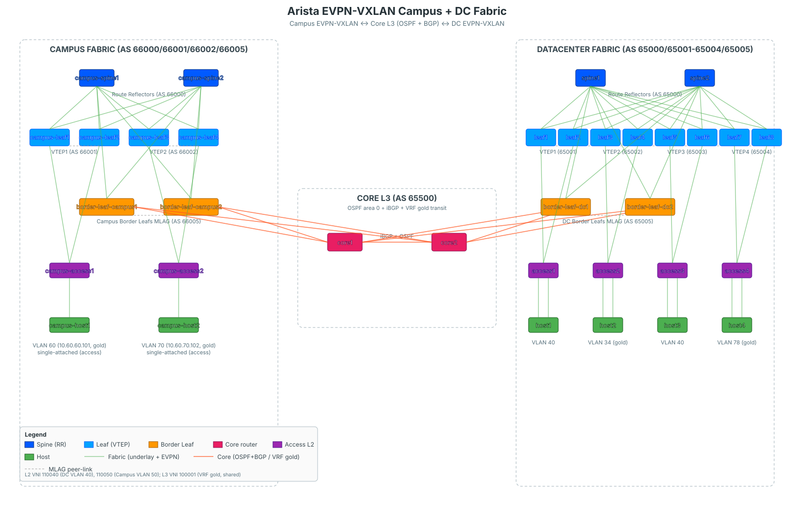

# Arista EVPN-VXLAN ContainerLab — DC + Core + Campus

An extended Arista BGP EVPN-VXLAN multi-fabric lab using ContainerLab and cEOS. The topology interconnects a **Data Center fabric** and a **Campus fabric** through a dedicated **Core L3 transit zone**, with a VRF (`gold`) stretched end-to-end across both fabrics.

## 🎯 Overview

| Zone   | Devices                                                                                 |
| ------ | --------------------------------------------------------------------------------------- |
| DC     | 2 spines, 8 leafs (4 MLAG VTEPs), 2 border leafs (MLAG), 4 access switches, 4 hosts     |
| Core   | 2 core routers (iBGP AS 65500, OSPF underlay with BLs, eBGP to DC & Campus BLs)         |
| Campus | 2 spines, 4 leafs (2 MLAG VTEPs), 2 border leafs (MLAG), 2 access switches, 2 hosts     |

Key design choices:

- **eBGP** in both fabrics (underlay + EVPN overlay) between spines and leafs / border leafs.
- **OSPF area 0 + eBGP multi-hop** between each Border Leaf pair and both Core routers (over dot1q subinterfaces: `.100` = default VRF underlay, `.200` = VRF `gold`).
- **MLAG** everywhere there is dual-homing (leaf pairs, border-leaf pairs, access → leafs, host → access).
- **VRF `gold`** is stretched end-to-end: DC leafs (VLAN 34 / 78) ↔ DC-BL ↔ Core ↔ Campus-BL ↔ Campus leafs (VLAN 60 / 70), all sharing L3 VNI `100001`.
- **VLAN 50** is a campus-local L2 VXLAN stretched between the two Campus VTEPs.
- **Convention**: L2 VNI = `110000 + vlan_id`, L3 VNI = `100001` for VRF `gold`, RT `1:100001` in both fabrics.

## 📐 Topology



## 🚀 Quick Start

### Prerequisites

- ContainerLab
- Docker
- Arista cEOS image: `ceos:4.35.0`

### Deploy the Lab

```bash
git clone https://gitea.arnodo.fr/Damien/arista-evpn-vxlan-clab.git
cd arista-evpn-vxlan-clab

sudo containerlab deploy -t evpn-lab.clab.yml
sudo containerlab inspect -t evpn-lab.clab.yml
```

### Access Devices

```bash
# SSH (password: admin) — works for every cEOS node
ssh admin@clab-arista-evpn-fabric-leaf1
ssh admin@clab-arista-evpn-fabric-core1
ssh admin@clab-arista-evpn-fabric-campus-leaf1

# Or via docker exec
docker exec -it clab-arista-evpn-fabric-border-leaf-dc1 Cli
```

## 📋 Architecture

### Node Inventory

| Zone   | Role                    | Nodes                                                  | AS     |
| ------ | ----------------------- | ------------------------------------------------------ | ------ |
| DC     | Spine                   | `spine1`, `spine2`                                     | 65000  |
| DC     | Leaf VTEP1 (MLAG)       | `leaf1`, `leaf2`                                       | 65001  |
| DC     | Leaf VTEP2 (MLAG)       | `leaf3`, `leaf4`                                       | 65002  |
| DC     | Leaf VTEP3 (MLAG)       | `leaf5`, `leaf6`                                       | 65003  |
| DC     | Leaf VTEP4 (MLAG)       | `leaf7`, `leaf8`                                       | 65004  |
| DC     | Border Leaf (MLAG)      | `border-leaf-dc1`, `border-leaf-dc2`                   | 65005  |
| DC     | Access (L2-only)        | `access1`-`access4`                                    | —      |
| DC     | Host                    | `host1`-`host4`                                        | —      |
| Core   | Core router             | `core1`, `core2`                                       | 65500  |
| Campus | Spine                   | `campus-spine1`, `campus-spine2`                       | 66000  |
| Campus | Leaf VTEP1 (MLAG)       | `campus-leaf1`, `campus-leaf2`                         | 66001  |
| Campus | Leaf VTEP2 (MLAG)       | `campus-leaf3`, `campus-leaf4`                         | 66002  |
| Campus | Border Leaf (MLAG)      | `border-leaf-campus1`, `border-leaf-campus2`           | 66005  |
| Campus | Access (L2-only)        | `campus-access1`, `campus-access2`                     | —      |
| Campus | Host                    | `campus-host1`, `campus-host2`                         | —      |

### AS Numbering

| AS    | Role                               |
| ----- | ---------------------------------- |
| 65000 | DC Spine                           |
| 65001 | DC VTEP1 (leaf1/2)                 |
| 65002 | DC VTEP2 (leaf3/4)                 |
| 65003 | DC VTEP3 (leaf5/6)                 |
| 65004 | DC VTEP4 (leaf7/8)                 |
| 65005 | DC Border Leaf pair                |
| 65500 | Core (iBGP between core1 & core2)  |
| 66000 | Campus Spine                       |
| 66001 | Campus VTEP1 (campus-leaf1/2)      |
| 66002 | Campus VTEP2 (campus-leaf3/4)      |
| 66005 | Campus Border Leaf pair            |

### Access Switches

| Access Switch   | Uplink Pair              | VLANs    | Host           |
| --------------- | ------------------------ | -------- | -------------- |
| access1         | leaf1/2 (VTEP1)          | 40       | host1          |
| access2         | leaf3/4 (VTEP2)          | 34       | host2          |
| access3         | leaf5/6 (VTEP3)          | 40       | host3          |
| access4         | leaf7/8 (VTEP4)          | 78       | host4          |
| campus-access1  | campus-leaf1/2 (VTEP1)   | 50, 60   | campus-host1   |
| campus-access2  | campus-leaf3/4 (VTEP2)   | 50, 70   | campus-host2   |

All access switches are L2-only, LACP-bonded to their leaf MLAG pair via `Port-Channel10`, with host downlinks on `Port-Channel1`. MSTP + edge-port BPDU guard.

## 🧭 IP Addressing Plan

### Management (`172.16.0.0/24`)

| Node                      | IP              | Node                      | IP              |
| ------------------------- | --------------- | ------------------------- | --------------- |
| spine1                    | 172.16.0.1      | campus-spine1             | 172.16.0.20     |
| spine2                    | 172.16.0.2      | campus-spine2             | 172.16.0.21     |
| border-leaf-dc1           | 172.16.0.3      | border-leaf-campus1       | 172.16.0.22     |
| border-leaf-dc2           | 172.16.0.4      | border-leaf-campus2       | 172.16.0.23     |
| core1                     | 172.16.0.10     | campus-leaf1-4            | 172.16.0.51-54  |
| core2                     | 172.16.0.11     | campus-access1            | 172.16.0.61     |
| leaf1                     | 172.16.0.25     | campus-access2            | 172.16.0.62     |
| leaf2                     | 172.16.0.50     | host1-4                   | 172.16.0.101-104|
| leaf3-8                   | 172.16.0.27-32  | campus-host1              | 172.16.0.105    |
| access1-4                 | 172.16.0.41-44  | campus-host2              | 172.16.0.106    |

Gateway: `172.16.0.254`.

### Router-ID Loopback0 (`Lo0`)

| Zone   | Range               | Nodes                                                                 |
| ------ | ------------------- | --------------------------------------------------------------------- |
| DC     | `10.0.250.0/24`     | spine1 .1, spine2 .2, leaf1-8 .11-.18, BL-dc1 .21, BL-dc2 .22         |
| Core   | `10.0.200.0/24`     | core1 `10.0.200.1`, core2 `10.0.200.2`                                |
| Campus | `10.1.250.0/24`     | campus-spine1 .1, campus-spine2 .2, campus-leaf1-4 .11-.14, BL-campus1 .21, BL-campus2 .22 |

### VTEP Loopback1 (`Lo1`) — shared per MLAG pair

| Fabric | VTEP   | Address         | Leafs                  |
| ------ | ------ | --------------- | ---------------------- |
| DC     | VTEP1  | `10.0.255.11`   | leaf1, leaf2           |
| DC     | VTEP2  | `10.0.255.12`   | leaf3, leaf4           |
| DC     | VTEP3  | `10.0.255.13`   | leaf5, leaf6           |
| DC     | VTEP4  | `10.0.255.14`   | leaf7, leaf8           |
| DC     | BL     | `10.0.255.15`   | border-leaf-dc1/2      |
| Campus | VTEP1  | `10.1.255.11`   | campus-leaf1/2         |
| Campus | VTEP2  | `10.1.255.12`   | campus-leaf3/4         |
| Campus | BL     | `10.1.255.21`   | border-leaf-campus1/2  |

### Underlay P2P (`/31`)

| Segment                          | Subnets                                 |
| -------------------------------- | --------------------------------------- |
| DC spine1 ↔ leaf/BL              | `10.0.1.0/31` … `10.0.1.18/31`          |
| DC spine2 ↔ leaf/BL              | `10.0.2.0/31` … `10.0.2.18/31`          |
| DC MLAG iBGP SVIs (per pair)     | `10.0.3.0/31`, `.2/31`, `.4/31`, `.6/31`, `.8/31` (BL) |
| DC MLAG peer-link SVIs           | `10.0.199.240/31` … `10.0.199.246/31`   |
| DC-BL ↔ Core (default, `.100`)   | `10.0.4.0/31` .. `10.0.4.6/31`          |
| DC-BL ↔ Core (VRF gold, `.200`)  | `10.0.14.0/31` .. `10.0.14.6/31`        |
| Campus-BL ↔ Core (default)       | `10.0.5.0/31` .. `10.0.5.6/31`          |
| Campus-BL ↔ Core (VRF gold)      | `10.0.15.0/31` .. `10.0.15.6/31`        |
| Core1 ↔ Core2 (default)          | `10.0.200.128/31`                       |
| Core1 ↔ Core2 (VRF gold)         | `10.0.200.130/31`                       |
| Campus spine1 ↔ leaf/BL          | `10.1.1.0/31` … `10.1.1.10/31`          |
| Campus spine2 ↔ leaf/BL          | `10.1.2.0/31` … `10.1.2.10/31`          |
| Campus MLAG iBGP SVIs            | `10.1.3.0/31`, `.2/31`, `.4/31`         |
| Campus MLAG peer-link SVIs       | `10.1.199.250/31` … `10.1.199.254/31`   |

### Host Addressing

| Host          | VLAN | VRF      | IP / Mask         | Gateway      | Purpose                        |
| ------------- | ---- | -------- | ----------------- | ------------ | ------------------------------ |
| host1         | 40   | default  | 10.40.40.101/24   | —            | DC L2 stretched (VTEP1↔VTEP3)  |
| host2         | 34   | gold     | 10.34.34.102/24   | 10.34.34.1   | DC L3 VRF gold                 |
| host3         | 40   | default  | 10.40.40.103/24   | —            | DC L2 stretched                |
| host4         | 78   | gold     | 10.78.78.104/24   | 10.78.78.1   | DC L3 VRF gold                 |
| campus-host1  | 50   | default  | 10.50.50.101/24   | —            | Campus L2 stretched (VTEP1↔VTEP2) |
| campus-host1  | 60   | gold     | 10.60.60.101/24   | 10.60.60.1   | Campus L3 VRF gold             |
| campus-host2  | 50   | default  | 10.50.50.102/24   | —            | Campus L2 stretched            |
| campus-host2  | 70   | gold     | 10.60.70.102/24   | 10.60.70.1   | Campus L3 VRF gold             |

## 🏷️ VXLAN Network Identifiers

### L2 VNI Mapping

| VLAN | Description                    | VNI    | Scope                                                  | RT         |
| ---- | ------------------------------ | ------ | ------------------------------------------------------ | ---------- |
| 40   | DC L2 VXLAN (stretched)        | 110040 | DC VTEP1 (leaf1/2) + VTEP3 (leaf5/6)                   | 40:110040  |
| 50   | Campus L2 VXLAN (stretched)    | 110050 | Campus VTEP1 (campus-leaf1/2) + VTEP2 (campus-leaf3/4) | 50:110050  |
| 34   | DC VRF gold subnet (local)     | 110034 | DC VTEP2 only (anycast GW 10.34.34.1)                  | 34:110034  |
| 78   | DC VRF gold subnet (local)     | 110078 | DC VTEP4 only (anycast GW 10.78.78.1)                  | 78:110078  |
| 60   | Campus VRF gold subnet (local) | 110060 | Campus VTEP1 only (anycast GW 10.60.60.1)              | 60:110060  |
| 70   | Campus VRF gold subnet (local) | 110070 | Campus VTEP2 only (anycast GW 10.60.70.1)              | 70:110070  |

### L3 VNI Mapping (end-to-end)

| VRF  | L3 VNI  | RT         | Scope                                                 |
| ---- | ------- | ---------- | ----------------------------------------------------- |
| gold | 100001  | 1:100001   | DC VTEP2/VTEP4/DC-BL + Campus VTEP1/VTEP2/Campus-BL   |

VRF `gold` is announced over EVPN Type-5 (IP prefix) inside each fabric, and **stitched by the Core** via eBGP IPv4 unicast in VRF gold (over the `.200` dot1q subinterfaces). L3 VNI `100001` is re-used end-to-end for symmetry; RT `1:100001` is consistent across both fabrics.

### Route Distinguisher Convention

- Leafs / BLs: `rd <Loopback0>:1` for VRF gold; `rd <AS>:<L2_VNI>` per L2 VLAN (e.g. `65001:110040`, `66002:110050`).
- Cores: `rd <Loopback0>:100001` for VRF gold (transit only — no EVPN, IPv4 unicast with `redistribute connected`).

## 🔀 Control Plane Summary

| Segment                             | Protocol                             | Notes                                 |
| ----------------------------------- | ------------------------------------ | ------------------------------------- |
| DC spine ↔ leaf/BL underlay         | eBGP IPv4 (AS 65000 ↔ 650xx)         | `maximum-paths 4 ecmp 64`             |
| DC spine ↔ leaf/BL overlay          | eBGP EVPN via Loopback0, multi-hop 3 | Spines reflect via `ebgp peer-group`  |
| DC MLAG pair iBGP                   | iBGP over VLAN 4091 SVI              | `next-hop-self`                       |
| DC-BL ↔ Core (default)              | OSPF area 0 + eBGP AS 65005 ↔ 65500  | on `.100` dot1q subinterface          |
| DC-BL ↔ Core (VRF gold)             | eBGP AS 65005 ↔ 65500                | on `.200` dot1q subinterface          |
| Core1 ↔ Core2 (default)             | OSPF area 0 + iBGP AS 65500          | via Loopback0                         |
| Core1 ↔ Core2 (VRF gold)            | iBGP AS 65500                        | VRF-aware over `.200` subinterface    |
| Campus-BL ↔ Core (default / gold)   | OSPF + eBGP AS 66005 ↔ 65500         | same pattern as DC-BL                 |
| Campus spine ↔ leaf/BL underlay     | eBGP IPv4 (AS 66000 ↔ 660xx)         |                                       |
| Campus spine ↔ leaf/BL overlay      | eBGP EVPN via Loopback0, multi-hop 3 |                                       |
| Campus MLAG pair iBGP               | iBGP over VLAN 4091 SVI              |                                       |

## 🧪 Testing & Validation

### Fabric health

```bash
# DC
ssh admin@clab-arista-evpn-fabric-spine1 "show bgp evpn summary"
ssh admin@clab-arista-evpn-fabric-leaf3 "show bgp evpn summary"
ssh admin@clab-arista-evpn-fabric-border-leaf-dc1 "show bgp evpn summary"

# Campus
ssh admin@clab-arista-evpn-fabric-campus-spine1 "show bgp evpn summary"
ssh admin@clab-arista-evpn-fabric-campus-leaf1 "show bgp evpn summary"

# Core transit (no EVPN — IPv4 only)
ssh admin@clab-arista-evpn-fabric-core1 "show ip bgp summary"
ssh admin@clab-arista-evpn-fabric-core1 "show ip bgp summary vrf gold"
ssh admin@clab-arista-evpn-fabric-core1 "show ip ospf neighbor"
```

### VXLAN

```bash
# On any leaf/BL
show interface vxlan1
show vxlan vtep
show vxlan address-table
```

### MLAG

```bash
show mlag
show mlag interfaces detail
```

### Intra-DC connectivity (existing tests)

```bash
# L2 VLAN 40: host1 ↔ host3
docker exec -it clab-arista-evpn-fabric-host1 ping -c 3 10.40.40.103

# L3 VRF gold (DC only): host2 ↔ host4
docker exec -it clab-arista-evpn-fabric-host2 ping -c 3 10.78.78.104
```

### Intra-Campus connectivity

```bash
# L2 VLAN 50: campus-host1 ↔ campus-host2
docker exec -it clab-arista-evpn-fabric-campus-host1 ping -c 3 10.50.50.102

# L3 VRF gold (Campus only): campus-host1 ↔ campus-host2
docker exec -it clab-arista-evpn-fabric-campus-host1 ping -c 3 10.60.70.102
docker exec -it clab-arista-evpn-fabric-campus-host2 ping -c 3 10.60.60.101
```

### End-to-end Campus ↔ DC (VRF gold via Core)

```bash
# campus-host1 (10.60.60.101, VRF gold Campus) → host2 (10.34.34.102, VRF gold DC)
docker exec -it clab-arista-evpn-fabric-campus-host1 ping -c 3 10.34.34.102

# campus-host2 (10.60.70.102) → host4 (10.78.78.104)
docker exec -it clab-arista-evpn-fabric-campus-host2 ping -c 3 10.78.78.104

# Reverse direction
docker exec -it clab-arista-evpn-fabric-host2 ping -c 3 10.60.60.101
docker exec -it clab-arista-evpn-fabric-host4 ping -c 3 10.60.70.102

# Traceroute: expected path campus-leaf → campus-BL → core → DC-BL → DC-leaf
docker exec -it clab-arista-evpn-fabric-campus-host1 traceroute 10.34.34.102
```

### Inspect the Core transit path

```bash
# Check VRF gold routes on core1 — both DC and Campus prefixes should be present
ssh admin@clab-arista-evpn-fabric-core1 "show ip route vrf gold"
ssh admin@clab-arista-evpn-fabric-core1 "show ip bgp vrf gold"

# EVPN Type-5 on DC-BL (imported from DC fabric, redistributed from Core into EVPN)
ssh admin@clab-arista-evpn-fabric-border-leaf-dc1 "show bgp evpn route-type ip-prefix ipv4"

# EVPN Type-5 on Campus-BL
ssh admin@clab-arista-evpn-fabric-border-leaf-campus1 "show bgp evpn route-type ip-prefix ipv4"
```

## 📁 Repository Structure

```
arista-evpn-vxlan-clab/
├── README.md
├── TROUBLESHOOTING.md
├── END_TO_END_TESTING.md
├── evpn-lab.clab.yml
├── evpn-lab.clab.yml.annotations.json
├── assets/
│   └── arista-evpn-fabric.svg
├── configs/
│   ├── spine1.cfg, spine2.cfg
│   ├── leaf1.cfg … leaf8.cfg
│   ├── border-leaf-dc1.cfg, border-leaf-dc2.cfg
│   ├── access1.cfg … access4.cfg
│   ├── core1.cfg, core2.cfg
│   ├── campus-spine1.cfg, campus-spine2.cfg
│   ├── campus-leaf1.cfg … campus-leaf4.cfg
│   ├── border-leaf-campus1.cfg, border-leaf-campus2.cfg
│   └── campus-access1.cfg, campus-access2.cfg
└── hosts/
    ├── README.md
    ├── host1_interfaces … host4_interfaces
    ├── campus-host1_interfaces
    └── campus-host2_interfaces
```

## 🗑️ Cleanup

```bash
sudo containerlab destroy -t evpn-lab.clab.yml --cleanup
```

## 📚 References

- [Arista EOS Documentation](https://www.arista.com/en/support/product-documentation)
- [ContainerLab Documentation](https://containerlab.dev/)
- [RFC 7432 — BGP MPLS-Based Ethernet VPN](https://tools.ietf.org/html/rfc7432)
- [RFC 8365 — A Network Virtualization Overlay Solution Using EVPN](https://tools.ietf.org/html/rfc8365)
- [RFC 9135 — Integrated Routing and Bridging in EVPN](https://tools.ietf.org/html/rfc9135)
