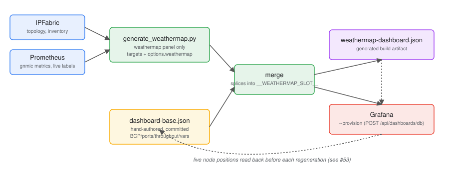

# scripts/generate_weathermap.py

Generates the **weathermap panel only** from live IPFabric + Prometheus
data, merges it into a hand-authored dashboard base, and provisions the
result to Grafana.



## Files

| File                                        | What it is                                                                                                                                                                                      | Edit it?                |
| ------------------------------------------- | ----------------------------------------------------------------------------------------------------------------------------------------------------------------------------------------------- | ----------------------- |
| `configs/grafana/dashboard-base.json`       | Hand-authored: BGP table, ports table, throughput graphs, `site`/`device` variables, layout. Has one reserved slot panel (`title: "__WEATHERMAP_SLOT__"`) where the weathermap gets spliced in. | Yes, directly           |
| `configs/grafana/weathermap-dashboard.json` | Generated build artifact — base + fresh weathermap panel, merged. What actually gets provisioned.                                                                                               | No — regenerate instead |

Why split like this: topology data (nodes/links) changes with the lab and
should regenerate every time; the rest of the dashboard (table layout,
thresholds, transformations) is hand-tuned and shouldn't be touched by a
topology refresh. See #52.

## Quickstart

```bash
cp envrc.sample .envrc   # fill in the values (see "Credentials" below)
source .envrc

python3 scripts/generate_weathermap.py              # dry run: writes the JSON only
python3 scripts/generate_weathermap.py --provision   # also pushes it to Grafana
```

Re-run the same `--provision` command any time the lab topology changes —
the script always rebuilds the weathermap panel from live data, so there's
nothing to "detect", just re-run it. It's not automated yet (no watcher/CI
hook), so re-running is a manual step for now.

## Credentials

| Value                         | Env var                                                                 | Get it from the UI                                                                                    | Get it via API                                                                                               |
| ----------------------------- | ----------------------------------------------------------------------- | ----------------------------------------------------------------------------------------------------- | ------------------------------------------------------------------------------------------------------------ |
| IPFabric token                | `IPFABRIC_TOKEN`                                                        | IPFabric → user menu → Settings → API Tokens → Add token                                              | not possible, UI-only                                                                                        |
| Grafana service account token | `GRAFANA_TOKEN`                                                         | Grafana → Administration → Service accounts → Add → give it **Editor** role → Add token               | possible but multi-step (create account, then create token under it) — UI is simpler                         |
| Prometheus datasource UID     | `GRAFANA_DATASOURCE_UID`                                                | Grafana → Connections → Data sources → open the one with gnmic data → UID is the last part of the URL | `curl -s -H "Authorization: Bearer $GRAFANA_TOKEN" "$GRAFANA_URL/api/datasources" \| jq '.[] \| {name,uid}'` |
| Weathermap plugin ID          | `GRAFANA_WEATHERMAP_PLUGIN_ID` (optional, only if not the default fork) | Grafana → Administration → Plugins → search "weathermap" → id is in the URL                           | —                                                                                                            |

⚠️ The datasource must be the one that can actually see gnmic metrics —
picking an unrelated Prometheus instance renders the panel with no data
(see #48).

## Verifying the result

**In the browser** (the only way to actually see it render — colors,
tables, and the ports-table merge transformation all happen client-side):

1. Open `$GRAFANA_URL/d/evpn-vxlan-fabric-weathermap`.
2. Weathermap: nodes grouped spine-top → access-bottom, all green.
3. `site`/`device` dropdowns filter the two tables below.
4. BGP Sessions / Ports tables: populated, green=Up / red=Down.
5. Throughput per Site: signed graph, non-zero values.

**Without a browser**, use Grafana's **Explore** view (paste a PromQL
expression from the panel JSON and run it) — same result as the UI check
above minus the rendering, no `curl` needed. Or hit the API directly:

```bash
curl -s -X POST -H "Authorization: Bearer $GRAFANA_TOKEN" -H "Content-Type: application/json" \
  "$GRAFANA_URL/api/ds/query" -d '{
    "queries": [{"refId":"A","datasource":{"type":"prometheus","uid":"'"$GRAFANA_DATASOURCE_UID"'"},
                 "expr":"min by (device) (interfaces_interface_state_oper_status)","instant":true}],
    "from":"now-5m","to":"now"}' | python3 -m json.tool
```

## Troubleshooting

| Symptom                                                    | Cause                                                               | Check                                                              |
| ---------------------------------------------------------- | ------------------------------------------------------------------- | ------------------------------------------------------------------ |
| `Refusing to provision: set GRAFANA_DATASOURCE_UID...`     | Env var unset                                                       | `echo $GRAFANA_DATASOURCE_UID`                                     |
| Panel renders with no data                                 | Wrong datasource — can't see gnmic metrics                          | Explore → run `up` against it, confirm gnmic series come back      |
| `Base dashboard has no panel titled '__WEATHERMAP_SLOT__'` | Someone edited `dashboard-base.json` and renamed/removed that panel | Check panel `id: 1` still has that exact title                     |
| Manually-moved node keeps resetting position               | `GRAFANA_URL`/`GRAFANA_TOKEN` weren't set for that run              | Look for `Fetching live node positions from ...` in the run output |
| `HTTP 401/403` fetching live positions                     | Expired/bad Grafana token                                           | Re-issue the service account token                                 |

## Environment variables

| Variable                       | Required           | Default                               |
| ------------------------------ | ------------------ | ------------------------------------- |
| `IPFABRIC_URL`                 | yes                | —                                     |
| `IPFABRIC_TOKEN`               | yes                | —                                     |
| `IPFABRIC_SNAPSHOT`            | no                 | `$last`                               |
| `PROMETHEUS_URL`               | no                 | `http://172.16.0.71:9090`             |
| `GRAFANA_URL`                  | no*                | —                                     |
| `GRAFANA_TOKEN`                | no*                | —                                     |
| `GRAFANA_DATASOURCE_UID`       | with `--provision` | —                                     |
| `GRAFANA_DASHBOARD_UID`        | no                 | `evpn-vxlan-fabric-weathermap`        |
| `GRAFANA_WEATHERMAP_PLUGIN_ID` | no                 | `tamirsuliman-weathermap-panel`       |
| `--base` (CLI flag)            | no                 | `configs/grafana/dashboard-base.json` |

\* `GRAFANA_URL`/`GRAFANA_TOKEN` are required for `--provision`, and
optional otherwise — if set on a plain (non-`--provision`) run, they're
used to read back live node positions so manual repositioning survives
the next regeneration (see #53). Skip them and every node just gets the
default layout.

## How it works

1. Fetch device inventory + connectivity-matrix from IPFabric.
2. Keep only physical Ethernet↔Ethernet links (drop management-plane and
   `.100`/`.200` subinterface rows), dedupe the two directions IPFabric
   reports per link.
3. Position each node:
    - **New node** → layered default: Y-tier by role parsed from the
      hostname (`spine → core → border-leaf → leaf → access`), X grouped
      by site within the tier. A hostname that matches no role is logged
      and dropped into a fallback tier, never silently misplaced (#53).
    - **Known node** → whatever position is currently live in Grafana,
      unchanged. This is why `GRAFANA_URL`/`GRAFANA_TOKEN` matter even on
      a dry run (#53).
4. Build the panel's PromQL `targets`: node status, link tx/rx, VXLAN
   MAC/VNI tooltip — each with an explicit `legendFormat`.
5. Build `nodes[]`/`links[]`, including the plugin's `anchors` tally
   (link count per side) — required by the installed plugin fork even
   though the schema doc says it's optional (#48).
6. Cross-check every interface name against the live gnmic exporter
   (`Et`→`Ethernet`, `Po`→`Port-Channel`, etc.); mismatches are logged,
   not dropped — the link stays, just without data until fixed upstream.
7. Load `dashboard-base.json`, substitute the real datasource UID, splice
   the generated panel into `__WEATHERMAP_SLOT__` (keeping that slot's
   `gridPos`/`id` — layout stays manual).
8. Write `weathermap-dashboard.json`; provision it if `--provision`.

## Known gaps

- **VXLAN MAC-per-VNI tooltip**: the `vlan` join key doesn't match on live
  data for any VTEP node, likely an Arista internal-vs-front-panel VLAN
  translation gap. Only affects that one decorative tooltip metric, not
  node/link status or traffic coloring. Tracked in #44.

# scripts/generate_traffic.sh

Generates real DC↔Campus traffic over VRF `gold` using `iperf3` (bundled
in the `network-multitool` image every host container runs), with a live
bandwidth dashboard. Without this, host containers sit idle and IPFabric
ARP/MAC tables, Grafana throughput graphs, and the weathermap panel stay
empty until someone manually generates traffic (see #55).

## Quickstart

```bash
./scripts/generate_traffic.sh <duration_seconds>
```

## How it works

- Starts `iperf3 -s` on the DC gold-VRF servers: `dc-server2`
  (10.34.34.102), `dc-server4` (10.78.78.104).
- Runs `iperf3 -c` from the paired campus gold-VRF hosts: `campus-host1`
  → dc-server2, `campus-host2` → dc-server4 — exercising the full
  DC→Core→Campus stitched EVPN Type-5 path end to end.
- Redraws a terminal dashboard every second for the run duration: server
  list, and live Mbits/sec per client session parsed from `iperf3 -i 1`
  output.
- On exit (duration end or Ctrl-C), kills the client processes and stops
  the `iperf3 -s` processes on the DC servers — no leftover state.

`dc-server1`/`dc-server3` (VLAN 40, VRF default, no gateway) are out of
scope — this script only exercises the routed gold VRF path.
